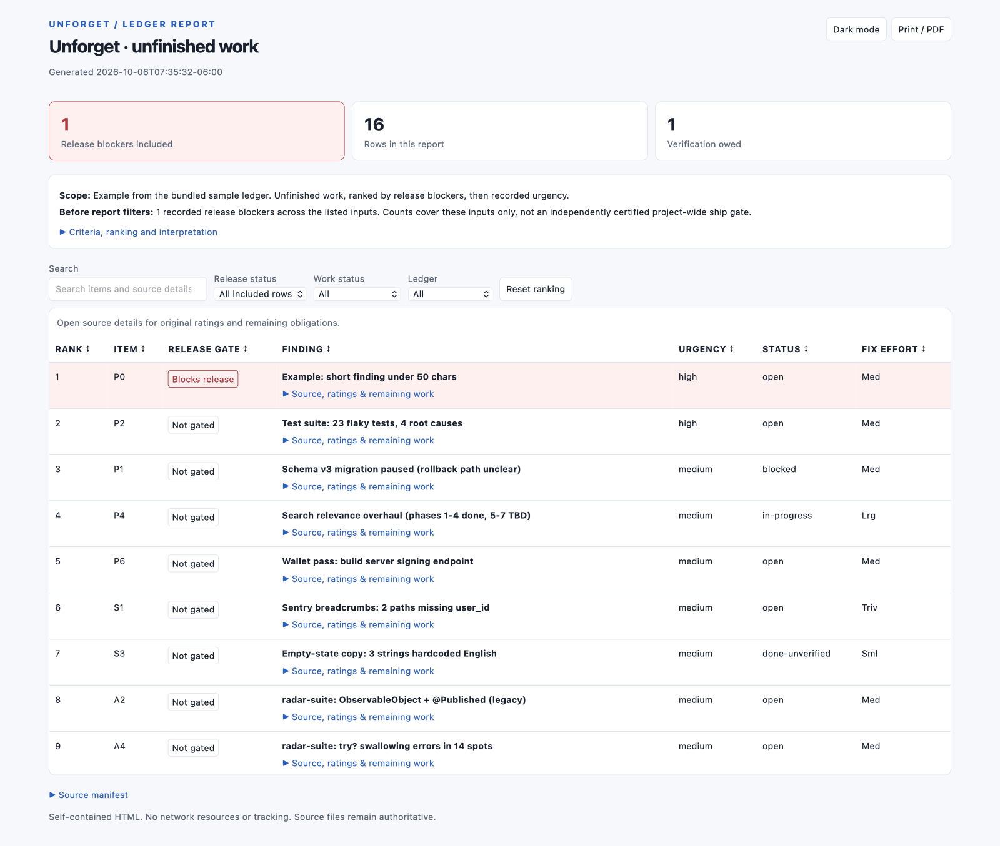
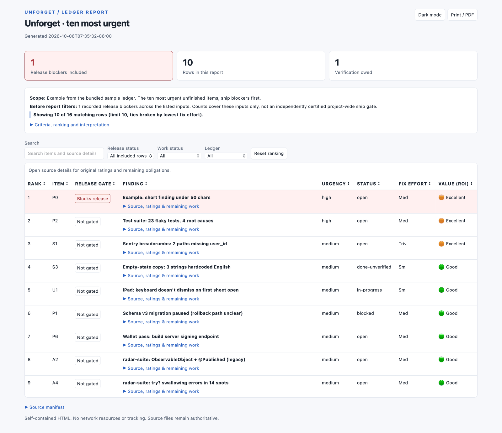
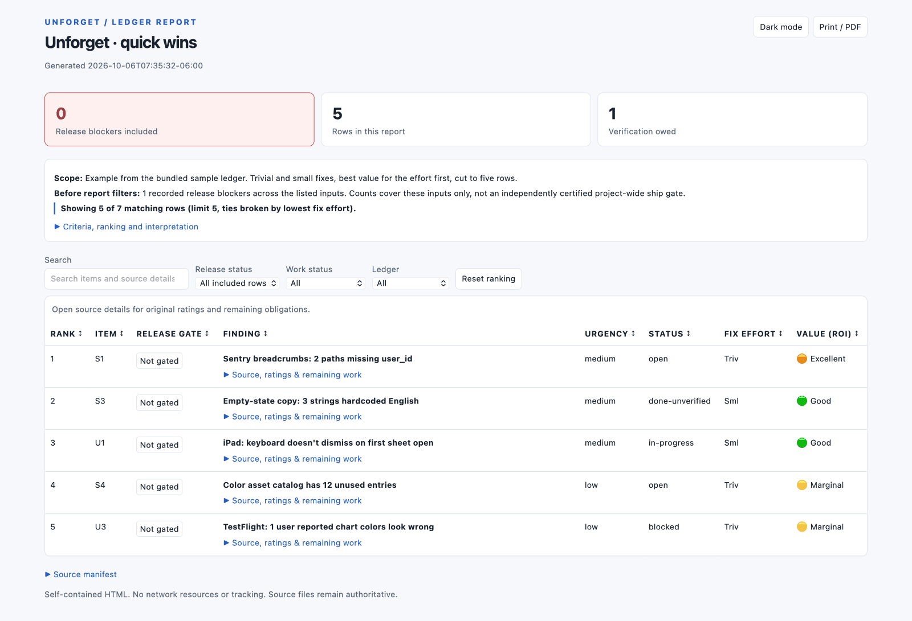
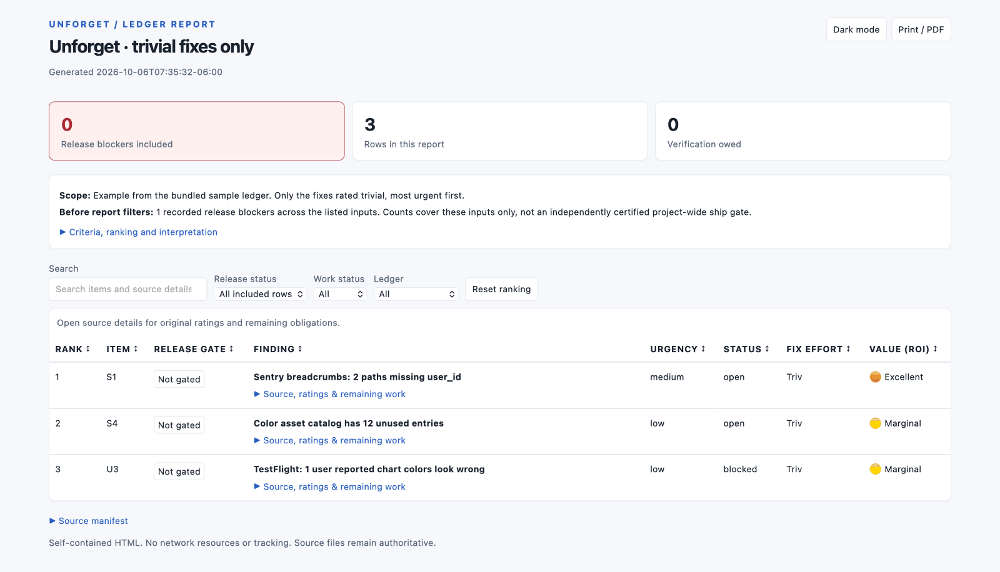
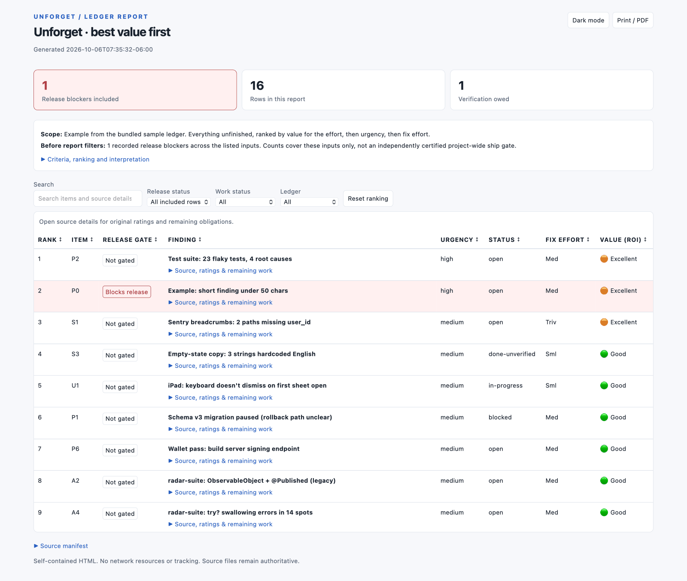
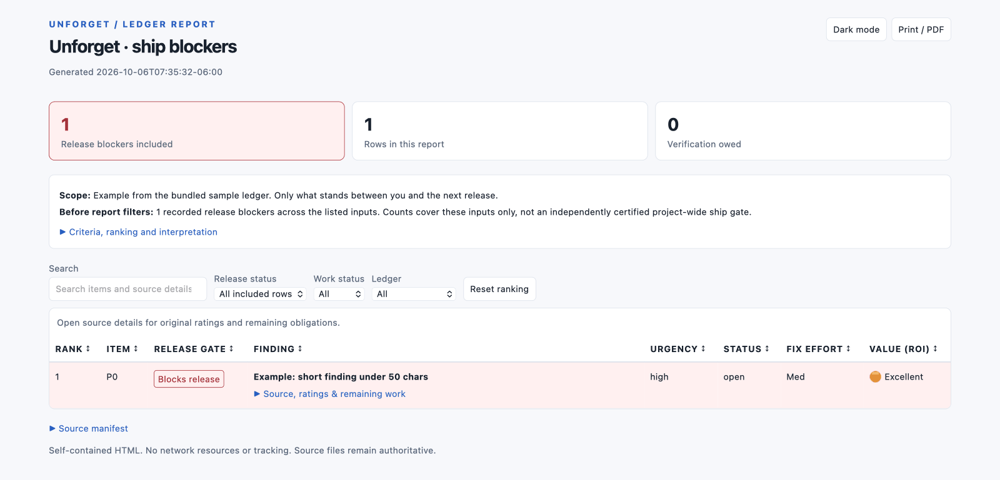

# Report examples

Every view below was generated from [UNFORGET.md](UNFORGET.md), the bundled sanitized sample
ledger. Each picture is a preview; the link beside it downloads the real page. Open the
downloaded file in your browser to try search, filters, sorting, expandable source details,
dark mode and printing. It works offline. (GitHub's file view shows a page's HTML source rather
than running it, which is why the links download.)

When unforget makes one of these for your own ledger, it opens the page in your browser as soon
as it's ready and tells you where the file is saved.

| View | What to type | Preview | Interactive page |
|---|---|---|---|
| **Unfinished work** (the default) | `/unforget report` | [](unfinished-ledger.png) | [Download](https://github.com/Terryc21/unforget/raw/refs/heads/main/examples/unfinished-ledger.html) |
| **Top 10 by urgency** | `/unforget report: show me the ten most urgent things` | [](top-10.png) | [Download](https://github.com/Terryc21/unforget/raw/refs/heads/main/examples/top-10.html) |
| **Quick wins** | `/unforget report: quick wins` | [](quick-wins.png) | [Download](https://github.com/Terryc21/unforget/raw/refs/heads/main/examples/quick-wins.html) |
| **Trivial fixes only** | `/unforget report: only trivial fixes` | [](trivial-fixes.png) | [Download](https://github.com/Terryc21/unforget/raw/refs/heads/main/examples/trivial-fixes.html) |
| **Best value first** | `/unforget report: best value first` | [](best-value.png) | [Download](https://github.com/Terryc21/unforget/raw/refs/heads/main/examples/best-value.html) |
| **Ship blockers** | `/unforget report: ship blockers only` | [](ship-blockers.png) | [Download](https://github.com/Terryc21/unforget/raw/refs/heads/main/examples/ship-blockers.html) |

**Reading the previews.** A view that was cut says so in plain sight, under its scope line:
"Showing 10 of 16 matching rows" on Top 10, "Showing 5 of 7" on Quick wins. On longer views the
table scrolls inside the page, so a preview shows the first rows only. The sample's illustrative
P0 row demonstrates a ship blocker. Completed and withdrawn work stays in the source but is left
out of these views. User-impact estimates are omitted because the sample doesn't record them.
This is sample data, not a live release assessment.

## Regenerating

From the repository root, with Python 3.9 or later:

```bash
python3 examples/generate_html.py
```

The script uses the shared report generator and template and rewrites every page listed in its
`PAGES` table (name one, such as `python3 examples/generate_html.py quick-wins.html`, to
regenerate only that page). The sample ledger stays unchanged. Source paths are relative to the
repository root, and each page records the source checksum and generation time.

The previews are Quick Look renders of each page (macOS), taken from a temporary copy zoomed to
a desktop-width layout, trimmed, and reduced to a 256-color palette. Refresh them after a
visible change to the report.

For your own ledger, ask Codex `$unforget report`, or use `/unforget report` in Claude Code
(`/unforget:unforget report` for a plugin install). See the
[report options](../reference/html-report.md) for custom scopes and rankings.
